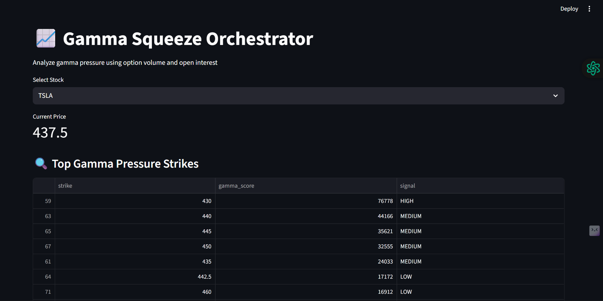

# 📈 Gamma Squeeze Orchestrator

An end-to-end analytics dashboard to detect **gamma pressure and potential gamma squeeze zones** using stock price data and options chain analysis.

This project uses **Python, Pandas, and Streamlit** to analyze option volume and open interest near ATM strikes and visualize results in an interactive dashboard.


## 🚀 Project Overview

A **Gamma Squeeze** occurs when heavy call option activity forces market makers to hedge by buying the underlying stock, creating upward price pressure.

This project:
- Analyzes **option chain data**
- Calculates **gamma pressure scores**
- Classifies signals into **Low / Medium / High**
- Displays insights through an **interactive Streamlit dashboard**


## 🧠 Key Features

- 📊 Real-time stock price fetching using Yahoo Finance  
- 🧮 Gamma score calculation using option volume & open interest  
- 🚦 Signal classification: **LOW / MEDIUM / HIGH gamma pressure**  
- 📈 Visualizations:
  - Stock price trend
  - Gamma pressure bar chart
- 🖥️ Interactive Streamlit dashboard with stock selector  


## 🛠️ Tech Stack

- **Programming Language:** Python  
- **Libraries:**  
  - pandas  
  - numpy  
  - yfinance  
  - matplotlib  
  - streamlit  
- **Visualization:** Matplotlib, Streamlit  
- **Data Source:** Yahoo Finance (Options Chain & Price Data)

---

## 📂 Project Structure
```
gamma-squeeze-orchestrator/
│
├── app/
│ └── dashboard.py # Streamlit dashboard
│
├── analysis/
│ ├── option_chain.py
│ ├── gamma_score.py
│ ├── gamma_signal.py
│ ├── signal_analytics.py
│
├── screenshots/
│ ├── dashboard_main.png
│ ├── gamma_pressure_chart.png
│ └── price_trend.png
│
├── requirements.txt
├── README.md
└── .gitignore
```
## ▶️ How to Run the Project

### 1️⃣ Clone the Repository

git clone https://github.com/9ariz1/gamma-squeeze-orchestrator.git
cd gamma-squeeze-orchestrator

2️⃣ Install Dependencies :

    pip install -r requirements.txt

3️⃣ Run Streamlit App :

    streamlit run app/main.py

4️⃣ Open in Browser :

    http://localhost:8501
    
📸 Screenshots
🔹 Dashboard Overview
      
🔹 Gamma Pressure Chart

   

🔹 Stock Price Trend

   
